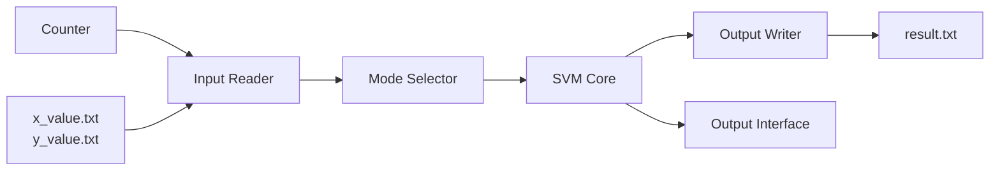
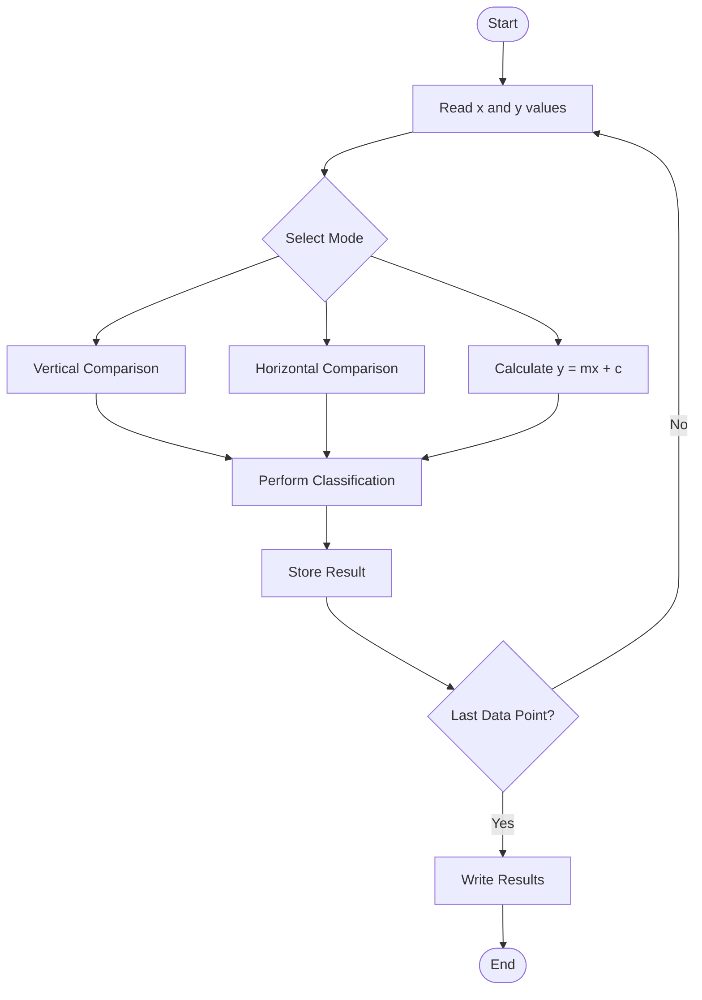

# 🧠 FPGA-Based Support Vector Machine (SVM) Classifier

**Hardware implementation of a binary classifier on FPGA**  
Classifies 2D points (x, y) using three modes: **Vertical**, **Horizontal**, and **Inclined** thresholding.  
Built with Verilog, simulated in ModelSim, and synthesized for the **DE2-115** board.


---

## 📑 Table of Contents
- [Project Overview](#project-overview)
- [System Architecture & Flowchart](#system-architecture--flowchart)
- [Modules Description and Verilog Code](#modules-description-and-verilog-code)
  - [1. Input Reader](#1-input-reader)
  - [2. Mode Selector](#2-mode-selector)
  - [3. SVM Core](#3-svm-core)
  - [4. Output Writer](#4-output-writer)
  - [5. Output Interface](#5-output-interface)
  - [6. System Tick](#6-system-tick)
  - [7. Counter](#7-counter)
  - [8. SEG7_LUT](#8-seg7_lut)
- [Top-Level Integration](#top-level-integration)
  - [svm_system](#svm_system)
  - [Project_ASIC (FPGA Top Wrapper)](#project_asic-fpga-top-wrapper)
- [Simulation & Testing](#simulation--testing)
  - [Testbench](#testbench)
  - [Simulation Waveforms](#simulation-waveforms)
- [FPGA Implementation](#fpga-implementation)
- [Results and Analysis](#results-and-analysis)
- [Engineering Constraints](#engineering-constraints)
- [Future Work](#future-work)
- [References](#references)

---

## Project Overview

This project implements a **binary classifier** on an FPGA that categorizes data points represented by (x, y) coordinates. The classification is performed using one of three modes:

- **Vertical Mode** – compares `x` against a fixed threshold (`x_threshold = 128`)
- **Horizontal Mode** – compares `y` against a fixed threshold (`y_threshold = 100`)
- **Inclined Mode** – computes `y_calc = m*x + c` (with `m = 1`, `c = 20`) and compares `y` against `y_calc`

The system reads x and y values from text files (`x_value.txt`, `y_value.txt`), processes them sequentially, and writes the classification results (0 or 1) to `result.txt`. Results are also displayed on LEDs and 7‑segment displays.

**Key objectives:**
- Modular Verilog design (input reader, mode selector, SVM core, output writer, display interface)
- Accurate classification for all three modes
- Simulation and hardware verification on DE2‑115 FPGA
- Real‑time visual feedback via LEDs and HEX displays


y ≥ 100 → Class 1
y < 100 → Class 0
```

#### Mode 10 – Inclined Boundary

Decision rule:

```
y ≥ (m × x + c)
```

where:

```
m = 1
c = 20
```

Therefore:

```
y ≥ x + 20 → Class 1
y < x + 20 → Class 0
```

---

# 🎯 Project Objectives

- Implement a hardware-based binary classifier.
- Design a fully modular Verilog architecture.
- Simulate classification using ModelSim.
- Deploy and verify functionality on DE2-115 FPGA.
- Display results through LEDs and 7-segment displays.
- Store classification outputs in memory files.

---

# 🏗️ System Architecture



---

# 🔄 System Flowchart



---

# 📦 Module Descriptions

## 1️⃣ Input Reader

### Purpose

Reads coordinate values from memory files.

### Inputs

| Signal | Description |
|----------|------------|
| clk | Clock |
| rst | Reset |
| start | Start processing |
| idx | Current address |

### Outputs

| Signal | Description |
|----------|------------|
| x_data | Current x value |
| y_data | Current y value |
| done | Processing complete |

### Functionality

- Loads data using `$readmemh`.
- Reads one point per cycle.
- Outputs coordinates to the classifier.

---

## 2️⃣ Mode Selector

### Purpose

Generates classification parameters according to selected mode.

### Modes

| Mode | Operation |
|--------|----------|
| 00 | Vertical |
| 01 | Horizontal |
| 10 | Inclined |

### Outputs

- x threshold
- y threshold
- calculated line value

---

## 3️⃣ SVM Core

### Purpose

Performs classification.

### Decision Logic

#### Vertical

```text
x ≥ threshold_x
```

#### Horizontal

```text
y ≥ threshold_y
```

#### Inclined

```text
y ≥ y_calc
```

### Output

```text
0 = Negative Class
1 = Positive Class
```

---

## 4️⃣ Output Writer

### Purpose

Stores classification results.

### Features

- Saves each classification result.
- Writes results into:

```text
result.txt
```

using:

```verilog
$writememh(...)
```

---

## 5️⃣ Output Interface

### Purpose

Provides visual feedback.

### LED Mapping

| LED | Mode |
|------|------|
| LED0 | Vertical |
| LED1 | Horizontal |
| LED2 | Inclined |

---

## 6️⃣ System Tick Generator

### Purpose

Generates periodic timing pulses.

### Function

Converts:

```text
50 MHz Clock
```

into slower control pulses used by the system.

---

## 7️⃣ Counter

### Purpose

Tracks current dataset index.

### Operation

```text
0 → 255
```

Each value corresponds to one coordinate pair.

---

## 8️⃣ SEG7 LUT

### Purpose

Controls 7-segment displays.

### Function

Converts:

```text
4-bit Hexadecimal
```

into:

```text
7-Segment Display Pattern
```

---

# 🧩 Top-Level Integration

## svm_system

The main controller that connects all modules.

```text
Counter
    ↓
Input Reader
    ↓
Mode Selector
    ↓
SVM Core
    ↓
Output Writer
    ↓
Output Interface
```

Responsibilities:

- Coordinates data flow.
- Selects classification mode.
- Controls output generation.
- Interfaces with FPGA peripherals.

---

# 🖥 FPGA Hardware Interface

## Inputs

| Component | Function |
|------------|-----------|
| KEY0 | Reset |
| SW0-SW1 | Mode Selection |
| SW2 | Enable |
| SW3 | Start |

---

## Outputs

| Component | Function |
|------------|-----------|
| LEDG0 | Done Signal |
| LEDR[2:0] | Classification LEDs |
| HEX0-HEX7 | Display Data |

---

# 🧪 Simulation Procedure

1. Compile all Verilog modules.
2. Compile testbench.
3. Load memory files.
4. Apply reset.
5. Enable start signal.
6. Observe:

- x_data
- y_data
- thresholds
- y_calc
- result

7. Verify generated `result.txt`.

---

# 📊 Example Classification

| X | Y | y = x+20 | Result |
|----|----|----------|--------|
| 48 | 114 | 68 | 1 |
| 80 | 179 | 100 | 1 |
| 120 | 122 | 140 | 0 |

---

# 📈 Results

### Accuracy

✅ Vertical Mode: 100%

✅ Horizontal Mode: 100%

✅ Inclined Mode: 100%

All FPGA outputs matched expected software calculations.

---

# ⚠ Engineering Constraints

### Memory

- Limited on-chip FPGA memory.

### Speed

- Must process data synchronously.

### Hardware Resources

- Logic utilization must remain low.

### Portability

- Memory file paths must be updated when moving projects between systems.

---

# 🚀 Future Improvements

### Advanced SVM Kernels

- Polynomial Kernel
- RBF Kernel
- Gaussian Kernel

### Real-Time Inputs

Replace text files with:

- UART
- Sensors
- ADC Inputs

### Display Improvements

Replace 7-segment displays with:

- LCD
- TFT Display
- HDMI Output

### Larger Datasets

Support:

```text
1024+
4096+
16384+
```

classification points.

### AI Extensions

Implement:

- Multi-class Classification
- Neural Network Accelerators
- Hardware Machine Learning Pipelines

---

# 📚 References

1. FPGA Implementations of Support Vector Machines
2. FPGA Prototyping by VHDL Examples – Pong P. Chu
3. Digital Design and Computer Architecture – Harris & Harris
4. SN Computer Science FPGA SVM Review Paper
